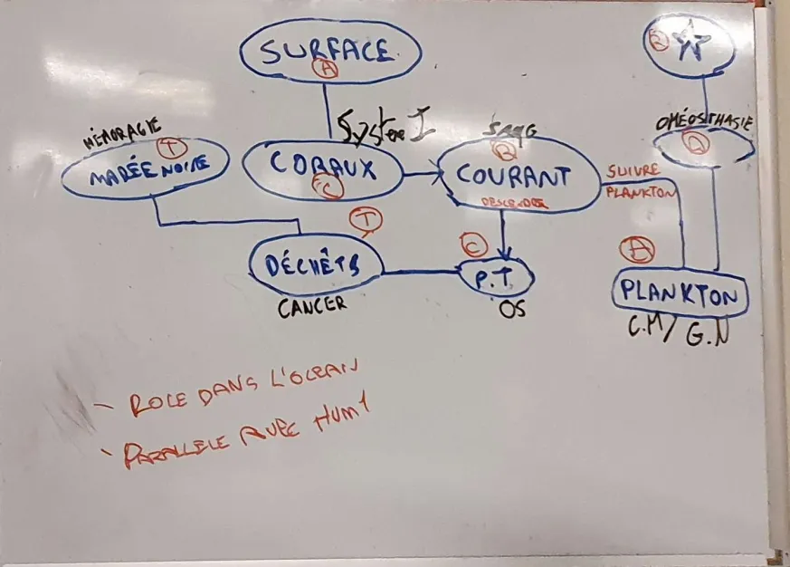

# Nuit du code 2024
Équipe Sans Nom (1)

Pour cette édition de la nuit du code, nous avons décidé de prendre une approche innovante au sujet.
Inspirés par le défi de gamification du site "On va jouer à un jeu !", nous avons combinés application web et jeu vidéo pour proposer une expérience à la fois interactive et immersive, tout en gardant son aspect éducatif ! C'est ainsi que notre projet est né, et nous en sommes très fiers !

## Le concept
Sans Nom (1) est une application web narrative dans laquelle nous incarnons un explorateur en sous-marin qui découvre les profondeurs océaniques. Le joueur explore différents endroits connus des océans, et en apprend plus sur le lien qu'ils ont avec le corps humain.

À travers des choix, deux fins sont accessibles qui abordent différents sujets en lien avec le fonctionnement des océans, leur apport positif, et l'impact de l'humain sur son écosystème.
Le joueur peut explorer la carte de lieu en lieu, à travers un système similaire au genre "Point and Click" du jeu vidéo.

